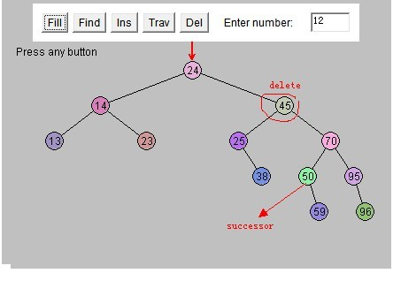

# BinaryTree
BinaryTree

实现二叉树的添加，查找，最小/大值，遍历（递归、非递归），删除，查找后继节点

## 后继节点

在删除的过程中，如果被删除的节点有两个子节点，那么删除该节点后，需要其后继节点来补位。

而后继节点，就是当前节点的右子节点的左子节点，左子节点的左子节点.....

如下图所示，45的后继节点是50

## 遍历

在非递归的遍历中，需要借助Stack和Queue来实现。

- Stack：栈，先进后出，继承Vector类

        Vector与ArrayList的区别：
        - Vector线程安全，ArrayList线程不安全。
        - ArrayList不可以设置扩展的容量，默认1.5倍；Vector可以设置扩展的容量，如果没有设置，默认2倍 
        - ArrayList的无参构造方法中初始容量为0，第一次扩容数量为10；而Vector的无参构造方法中初始容量为10。 
        
- Queue：队列，先进先出
        
        线程不安全
        LinkedList：实现Queue接口
        
        线程安全
        LinkedBlockingQueue：阻塞，使用ReentrantLock
        ConcurrentLinkedQueue：非阻塞，底层机器级别的原子指令来取代锁，CAS

